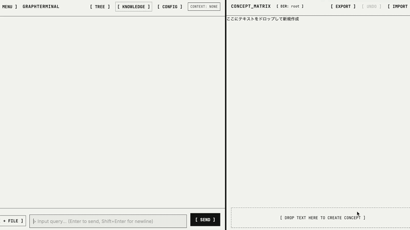

# 🌳 GraphTerminal 
*(formerly NEXUS_TERMINAL / TalkTree)*

[日本語 (Japanese) README](#-japanese)

> **"From Answer Generator to Understanding Engine."**
> A cognitive interface that treats interactions with LLMs not as a "chat history" but as an **"understanding structure"**.

**[▶ Try it Now](https://tmada1991.github.io/GraphTerminal/)** · **[🌐 Website / LP](https://slxbtybj.gensparkclaw.com)** · **[📝 Give Feedback](https://github.com/Tmada1991/GraphTerminal/issues)**

<!-- TODO: Insert demo GIF here -->

## 🧩 Overview
GraphTerminal is a UI that automatically extracts concepts from conversations with LLMs and dynamically builds them into a Tree (DAG) structure. It transforms fragments of knowledge from fleeting chat logs into a **"structurally understandable canvas"**.

---

## ❗ Why GraphTerminal? (The Problem)
Traditional Chat UIs suffer from several issues:
* Conversations flow linearly, making it hard to trace back thoughts.
* Knowledge becomes fragmented; connecting the dots is difficult.
* It is unclear what is actually understood and what remains ambiguous.
* Users end up asking the same questions repeatedly.

👉 **Result: "Information increases, but understanding does not deepen."**

GraphTerminal solves this by focusing on **"Thought Structures"** rather than "Chat Logs".

---

## 🧠 Core Features

### 1. Tree / DAG Based Conversation Management
* Branch off from any node and explore multiple thought paths in parallel.
* Treat your thoughts as a "structure", not a linear "history".

### 2. Concept Matrix (Structural View)
* Chat with the LLM on the left, oversee the structure on the right.
* Concepts and arguments are automatically organized as a tree.
* **Separates "Thinking" (Exploration) from "Summarizing" (Structuring).**

### 3. Node-Centric Design
Nodes are managed in units of **"Understanding"**:
* Concept / Question / Hypothesis / Fact

### 4. Visualization of "Un-understanding"
Assign states to nodes (e.g., Unresolved, Needs Verification, Ambiguous) to **explicitly show "what is NOT yet understood"**.

### 5. BYOK & Fully Local
* Runs entirely in your browser using your own API key (Gemini, etc.).
* No backend servers required; your data stays in your browser and your Google Drive.

---

## 🆚 Comparison with Traditional Chat

| Feature | Traditional Chat | GraphTerminal |
| --- | --- | --- |
| **Data Structure** | Linear | Tree / DAG |
| **Unit** | Utterance | Concept |
| **Goal** | Conversation | Understanding |
| **Handling of Unresolved logic** | None | Explicitly managed |

---

## 🧪 Current Status & Contribution
👉 **Experimental / Concept Phase**
* "We don't know the best UI yet."
* We are exploring better cognitive interfaces. UI/UX feedback, architectural discussions, and new use-case proposals are highly welcome! We are especially looking for help regarding DAG manipulation UX and better node visualization.

## 📜 License
This project is licensed under the [PolyForm Noncommercial License 1.0.0](./LICENSE).
*Free for personal, academic, and non-profit use. Commercial use is strictly prohibited.*

## 🌐 Website

[→ https://slxbtybj.gensparkclaw.com](https://slxbtybj.gensparkclaw.com)

---

 

# 🇯🇵 グラフターミナル (Japanese)

> **「答え生成機」から「理解エンジン」へ。**
> LLMとの対話を“履歴”ではなく**“理解構造”**として扱うためのコグニティブ・インターフェース。

## 🧩 概要
GraphTerminal は、LLMとの対話から概念を自動抽出し、ツリー（DAG）構造として構築・管理するUIです。
知識の断片を、ただ流れていくチャットログから**“理解可能な構造”**へと変換します。

---

## ❗ 解決する課題
従来のChat UIには以下の問題がありました：
* 会話が線形で流れてしまい、あとから見返せない
* 知識が断片化し、点と点が繋がらない
* 何が理解できていて、何が理解できていないか分からない
* 結局、同じ質問を繰り返してしまう

👉 **結果：「情報は増えるが、理解は深まらない」**

GraphTerminalは**「対話ログ」ではなく「思考構造」を扱う**というコンセプトで、この問題を解決します。

---

## 🧠 主な特徴

### 1. ツリー / DAGベースの対話管理
* 任意のノードから分岐（branch）し、複数の思考パスを並行して探索。

### 2. Concept Matrix（構造ビュー）
* 左でLLMと対話し、右で構造を俯瞰。概念や論点をツリーとして自動整理。
* **「考える（探索）」と「まとめる（構造化）」を分離するUI**。

### 3. ノード中心設計
発言単位ではなく、**“理解単位”**（概念/疑問/仮説/事実）でノードを管理します。

### 4. 未理解の可視化
ノードに状態（未理解・要検証・曖昧など）を持たせ、**「何が分かっていないか」を明示**します。

### 5. BYOK & 完全ローカル駆動
* お手持ちのAPIキーを入力するだけでブラウザ上で動作。バックエンド不要。

---

## 🆚 既存ツールとの違い

| 項目 | 従来チャット | GraphTerminal |
| --- | --- | --- |
| **データ構造** | 線形 (Linear) | ツリー / DAG |
| **単位** | 発言 (Utterance)| 概念 (Concept) |
| **目的** | 会話 (Chat) | 理解 (Understanding) |
| **未理解の扱い**| 無い | システム上で明示する |

---

## 🧪 現在のステータス & コントリビューション
👉 **Experimental / Concept Phase**
* "We don't know the best UI yet."
* より良い思考インターフェースを模索中です。UI/UXのフィードバック、構造設計の議論、新しいユースケースの提案を大歓迎します！特にノード構造の可視化改善やDAG操作のUI修正のPRをお待ちしています。

## 🌐 リンク

| | |
|---|---|
| **アプリ** | [▶ tmada1991.github.io/GraphTerminal](https://tmada1991.github.io/GraphTerminal/) |
| **LP** | [🌐 slxbtybj.gensparkclaw.com](https://slxbtybj.gensparkclaw.com) |
| **フィードバック** | [📝 Issues](https://github.com/Tmada1991/GraphTerminal/issues) |

## 📜 ライセンス
This project is licensed under the [PolyForm Noncommercial License 1.0.0](./LICENSE).
※個人利用・学術研究・非営利目的での利用/改変は完全自由です。商用利用は禁じます。

